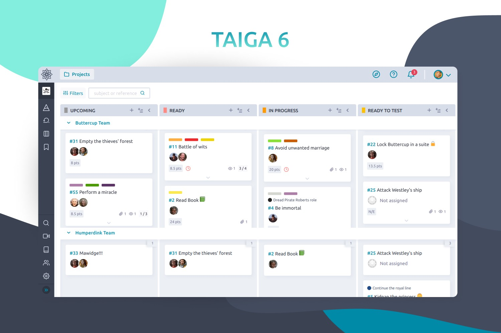
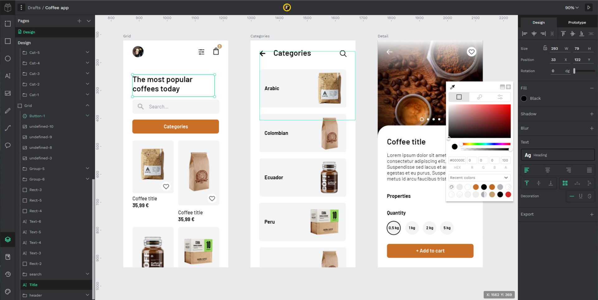

# Taiga Docker

## Getting Started

This section intends to explain how to get Taiga up and running in a simple two steps, using **docker** and **docker-compose**.

If you don't have docker installed, please follow installation instructions from docker.com: https://docs.docker.com/engine/install/

Additionally, it's necessary to have familiarity with Docker, docker-compose and Docker repositories.

**Note** branch `stable` should be used to deploy Taiga in production and `master` branch for development purposes.

### Start the application

```sh
$ ./launch-all.sh
```

After some instants, when the application is started you can proceed to create the superuser with the following script:

```sh
$ ./taiga-manage.sh createsuperuser
```

The `taiga-manage.sh` script lets launch manage.py commands on the
back instance:

```sh
$ ./taiga-manage.sh [COMMAND]
```

Default access for the application is **http://localhost:9000**.



As **EXTRA**: the default `launch-all.sh` script comes with [penpot](https://penpot.app), the open-source solution for design and prototyping. The default access for the penpot application is **http://locahost:9001**

It's developed by the same team behind Taiga. If you want to give it a try, you can go to [penpot's github](https://github.com/penpot/penpot/tree/develop/docs) to review its own configuration variables.



And finally if you just want to launch Taiga standalone, you can use the `launch-taiga.sh` script instead of the `launch-all.sh`.

## Documentation

Currently, we have authored three main documentation hubs:

- **[API](https://taigaio.github.io/taiga-doc/dist/api.html)**: Our API documentation and reference for developing from Taiga API.
- **[Documentation](https://taigaio.github.io/taiga-doc/dist/)**: If you need to install Taiga on your own server, this is the place to find some guides.
- **[Taiga Resources](https://resources.taiga.io)**: This page is intended to be the support reference page for the users.

## Bug reports

If you **find a bug** in Taiga you can always report it:

- in [Taiga issues](https://tree.taiga.io/project/taiga/issues). **This is the preferred way**
- in [Github issues](https://github.com/taigaio/taiga-docker/issues)
- send us a mail to support@taiga.io if is a bug related to [tree.taiga.io](https://tree.taiga.io)
- send us a mail to security@taiga.io if is a **security bug**

One of our fellow Taiga developers will search, find and hunt it as soon as possible.

Please, before reporting a bug, write down how can we reproduce it, your operating system, your browser and version, and if it's possible, a screenshot. Sometimes it takes less time to fix a bug if the developer knows how to find it.

## Community

If you **need help to setup Taiga**, want to **talk about some cool enhancemnt** or you have **some questions**, please write us to our [mailing list](https://groups.google.com/d/forum/taigaio).

If you want to be up to date about announcements of releases, important changes and so on, you can subscribe to our newsletter (you will find it by scrolling down at [https://taiga.io](https://www.taiga.io/)) and follow [@taigaio](https://twitter.com/taigaio) on Twitter.

## Contribute to Taiga

There are many different ways to contribute to Taiga's platform, from patches, to documentation and UI enhancements, just find the one that best fits with your skills. Check out our detailed [contribution guide](https://resources.taiga.io/extend/how-can-i-contribute/)

## Code of Conduct

Help us keep the Taiga Community open and inclusive. Please read and follow our [Code of Conduct](https://github.com/taigaio/code-of-conduct/blob/master/CODE_OF_CONDUCT.md).

## License

Every code patch accepted in Taiga codebase is licensed under [AGPL v3.0](http://www.gnu.org/licenses/agpl-3.0.html). You must be careful to not include any code that can not be licensed under this license.

Please read carefully [our license](https://github.com/taigaio/taiga-docker/blob/master/LICENSE) and ask us if you have any questions as well as the [Contribution policy](https://github.com/taigaio/taiga-docker/blob/master/CONTRIBUTING.md).

## Configuration with Environment Variables

There are some environment variables for a simple customization. Find
them in the `docker-compose.yml` and `docker-compose-inits.yml`. The
images are ready to work out of the box, although is strongly
recommended to change some default values.

**Important** Don't forget to review environment variables in
`docker-compose-inits.yml` as some of them are in both files.

### taiga-db

##### `POSTGRES_DB`, `POSTGRES_USER`, `POSTGRES_PASSWORD`

This vars will be used to create the database for Taiga.

**Important**: these vars should have the same values as `taiga-back` vars.


### taiga-back and taiga-async

#### Database settings

##### `POSTGRES_DB`, `POSTGRES_USER`, `POSTGRES_PASSWORD`

This vars will be used to connect to the Taiga database.

**Important**: these vars should have the same values as `taiga-db` service vars.

##### `POSTGRES_HOST`

Where the database is set. By default, it's meant to be in the same host as the database service so it uses internal docker names.

#### Taiga settings

##### `TAIGA_SECRET_KEY`

Is the secret key of Taiga. Should be the same as this var in `taiga-events` and `taiga-async`

Besides, this should have the same value of `SECRET_KEY` in `taiga-protected`.

##### `TAIGA_SITES_SCHEME`, `TAIGA_SITES_DOMAIN`

Should have the url where this is served: https[://]taiga.mycompany.com

#### Session Settings

You can add `SESSION_COOKIE_SECURE` and `CSRF_COOKIE_SECURE` to x-environment and change its value. By default is "True", so some browsers only accept https connections.
More info about these environment variables [here](https://docs.djangoproject.com/en/3.1/ref/settings/#csrf-cookie-secure).

#### Registration Settings

##### `PUBLIC_REGISTER_ENABLED`

If you want to allow a public register, configure this variable to "True". By default is "False".
Should be the same as this var in `taiga-front`.

#### Slack Settings

##### `ENABLE_SLACK`

Enable Slack integration in your Taiga instance. By default is "True". Should have the same value as this variable in taiga-front service.

#### Telemetry Settings

Telemetry anonymous data is collected in order to learn about the use of Taiga and improve the platform based on real scenarios.

##### `ENABLE_TELEMETRY`

You can opt out by setting this variable to "False". By default is "True".

#### Email Settings

By default, email is configured with the *console* backend, which means that the emails will be shown in the stdout.

##### Enable SMTP email

If you have an smtp service, uncomment the "Email settings" section in `docker-compose.yml` and configure those environment variables:

`DEFAULT_FROM_EMAIL`, `EMAIL_HOST`, `EMAIL_PORT`, `EMAIL_HOST_USER`, `EMAIL_HOST_PASSWORD`, `EMAIL_USE_TLS`, `EMAIL_USE_SSL`.

Uncomment `EMAIL_BACKEND` variable, but do not modify unless you know what you're doing.

#### Rabbit settings

##### `RABBITMQ_USER`, `RABBITMQ_PASS`

Are used to leave messages in the rabbitmq services. Those variables should be the same as in `taiga-async-rabbitmq` and `taiga-events-rabbitmq`.

#### Github settings

##### `ENABLE_GITHUB_AUTH`, `GITHUB_API_CLIENT_ID`, `GITHUB_API_CLIENT_SECRET`

Used for login with Github.
Get these in your profile https://github.com/settings/apps or in your organization profile https://github.com/organizations/{ORGANIZATION-SLUG}/settings/applications

**Note** `ENABLE_GITHUB_AUTH` should have the same value in taiga-back and taiga-front services

#### Gitlab settings

##### `ENABLE_GITLAB_AUTH`, `GITLAB_API_CLIENT_ID`, `GITLAB_API_CLIENT_SECRET`, `GITLAB_URL`

Used for login with GitLab.
Get these in your profile https://{YOUR-GITLAB}/profile/applications or in your organization profile https://{YOUR-GITLAB}/admin/applications

**Note** `ENABLE_GITLAB_AUTH` should have the same value in taiga-back and taiga-front services

#### Importers

It's possible to configure different platforms to import projects from them. Make sure that `ENABLE_XXXX_IMPORTER` envvar is configured in both taiga-back (x-environment) and taiga-front. In taiga-back environment variables, it's also necessary to configure different settings depending on the importer.

### taiga-async-rabbitmq

##### `RABBITMQ_ERLANG_COOKIE`

Is the secret erlang cookie.

##### `RABBITMQ_DEFAULT_USER`, `RABBITMQ_DEFAULT_PASS`, `RABBITMQ_DEFAULT_VHOST`

This vars will be used to connect to rabbitmq.

### taiga-front

##### `TAIGA_URL`

Where this Taiga instance should be served. It should be the same as `TAIGA_SITES_SCHEME`://`TAIGA_SITES_DOMAIN`.

##### `TAIGA_WEBSOCKETS_URL`

To connect to the events. This should have the same value as `TAIGA_SITES_DOMAIN`, ie: ws://taiga.mycompany.com

##### `PUBLIC_REGISTER_ENABLED`

If you want to allow a public register, configure this variable to "true". By default is "false".
Should be the same as this var in `taiga-back`.

##### `ENABLE_GITHUB_AUTH`, `GITHUB_CLIENT_ID`

Used for login with Github.
Get these in your profile https://github.com/settings/apps or in your organization profile https://github.com/organizations/{ORGANIZATION-SLUG}/settings/applications

**Note** `ENABLE_GITHUB_AUTH` should have the same value in taiga-back and taiga-front services

##### `ENABLE_GITLAB_AUTH`, `GITLAB_CLIENT_ID`, `GITLAB_URL`

Used for login with GitLab.
Get these in your profile https://{YOUR-GITLAB}/profile/applications or in your organization profile https://{YOUR-GITLAB}/admin/applications

**Note** `ENABLE_GITLAB_AUTH` should have the same value in taiga-back and taiga-front services

##### `ENABLE_SLACK`

Enable Slack integration in your Taiga instance. By default is "true". Should have the same value as this variable in taiga-back service.

#### Importers

It's possible to configure different platforms to import projects from them. Make sure that `ENABLE_XXXX_IMPORTER` envvar is configured in both taiga-back (x-environment) and taiga-front.

### taiga-protected

##### `SECRET_KEY`

Should be the same as this var in `taiga-back`.

##### `MAX_AGE`

The attachments will be accesible with a token during MAX_AGE (in seconds). After that, the token will expire.


### taiga-events

##### `RABBITMQ_USER`, `RABBITMQ_PASS`

Are used to read messages from rabbitmq

##### `TAIGA_SECRET_KEY`

Should be the same as this var in `taiga-back`


### taiga-events-rabbitmq

##### `RABBITMQ_ERLANG_COOKIE`

Is the secret erlang cookie.

##### `RABBITMQ_DEFAULT_USER`, `RABBITMQ_DEFAULT_PASS`, `RABBITMQ_DEFAULT_VHOST`

This vars will be used to connect to rabbitmq.


## Storage

We have 3 named volumes configured: `taiga-static-data` for statics, `taiga-media-data` for medias and `taiga-db-data` for the database.


## Advanced customization (via configuration files)

For a advanced customization, you can use configuration files, mapped to specific directories inside the containers.

### taiga-back

Map a Python configuration file to `/taiga-back/settings/config.py`. You can use (this file)[https://raw.githubusercontent.com/taigaio/taiga-back/master/docker/config.py] as an example.

**Important**: if you use your own configuration file, don't forget to add contribs to `INSTALLED_APPS` (check the example `config.py`).

### taiga-front

Map a `conf.json`configuration file to `/usr/share/nginx/html/conf.json`. You can use (this file)[https://raw.githubusercontent.com/taigaio/taiga-front/master/docker/conf.json.template] as an example.
